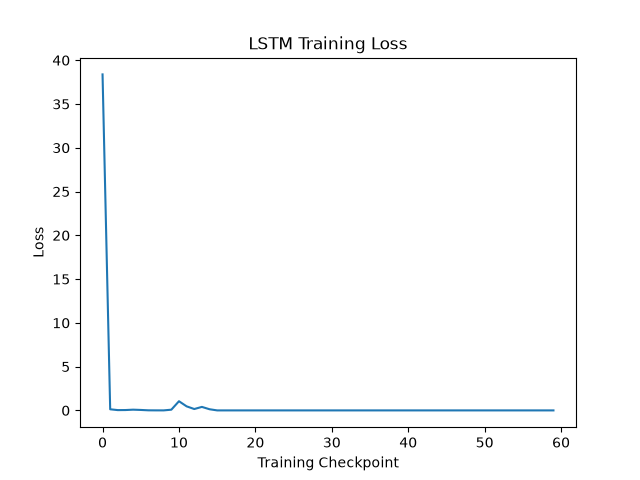

# LSTM From Scratch

A Long Short-Term Memory (LSTM) network implemented from scratch using Python and NumPy.

The goal of this project is to understand the internal mechanics of LSTMs, including the cell state, hidden state, gates, forward propagation, Backpropagation Through Time (BPTT), gradient clipping, and parameter updates.

## Project Overview

The model learns a simple sequential numerical pattern.

### Training Examples

| Input Sequence | Target |
|---|---:|
| [1, 2, 3] | 4 |
| [2, 3, 4] | 5 |
| [3, 4, 5] | 6 |
| [4, 5, 6] | 7 |
| [5, 6, 7] | 8 |

The model receives a sequence of three numbers and predicts the next number.

## LSTM Architecture

Unlike a vanilla RNN, an LSTM maintains both a hidden state and a cell state.

```text
                    ┌───────────────┐
                    │  Forget Gate  │
                    └───────┬───────┘
                            │
xₜ + hₜ₋₁ ──────────────────┼────────→ Cell State cₜ
                            │
                    ┌───────┴───────┐
                    │   Input Gate  │
                    └───────────────┘
                            │
                    ┌───────────────┐
                    │ Output Gate   │
                    └───────┬───────┘
                            ↓
                           hₜ
```

## Mathematical Formulation

### Forget Gate

```text
fₜ = σ(Wf × [hₜ₋₁, xₜ] + bf)
```

Determines how much information from the previous cell state should be retained.

### Input Gate

```text
iₜ = σ(Wi × [hₜ₋₁, xₜ] + bi)
```

Determines how much new information should enter the cell state.

### Candidate Cell State

```text
gₜ = tanh(Wg × [hₜ₋₁, xₜ] + bg)
```

Creates candidate information that can be added to the cell state.

### Cell State

```text
cₜ = fₜ ⊙ cₜ₋₁ + iₜ ⊙ gₜ
```

The cell state carries information through the sequence.

### Output Gate

```text
oₜ = σ(Wo × [hₜ₋₁, xₜ] + bo)
```

Determines how much of the cell state becomes the hidden state.

### Hidden State

```text
hₜ = oₜ ⊙ tanh(cₜ)
```

The hidden state is used to produce the final output.

## Implementation

This LSTM is implemented using NumPy without TensorFlow or PyTorch.

The implementation includes:

- LSTM parameter initialization
- Forget gate
- Input gate
- Candidate cell state
- Output gate
- Cell-state computation
- Hidden-state computation
- Forward propagation
- Mean Squared Error
- Backpropagation Through Time
- Gradient clipping
- Gradient descent
- Sequence prediction
- Training-loss visualization

## Backpropagation Through Time

The model calculates gradients by propagating them backward through every timestep.

```text
Forward:

x₁ → LSTM → h₁,c₁
             ↓
x₂ → LSTM → h₂,c₂
             ↓
x₃ → LSTM → h₃,c₃
             ↓
          Prediction


Backward:

Prediction
    ↓
h₃,c₃
    ↓
h₂,c₂
    ↓
h₁,c₁
```

Gradients are calculated for the LSTM parameters and output layer.

Gradient clipping is applied before updating the parameters.

## Training Process

```text
Forward Pass
      ↓
Calculate Prediction
      ↓
Calculate MSE Loss
      ↓
Backpropagation Through Time
      ↓
Calculate Gradients
      ↓
Gradient Clipping
      ↓
Update Parameters
      ↓
Repeat
```

## Training Loss

The model records the training loss during training.



The loss decreases as the LSTM learns the simple numerical sequence.

## Example Prediction

```text
Input:
[2, 3, 4]

Expected:
5

Prediction:
approximately 5
```

## RNN vs LSTM

| Feature | RNN | LSTM |
|---|---|---|
| Hidden State | Yes | Yes |
| Cell State | No | Yes |
| Forget Gate | No | Yes |
| Input Gate | No | Yes |
| Output Gate | No | Yes |
| Long-term Memory | Limited | Improved |
| Main Problem | Vanishing gradients | Designed to reduce this problem |

## Important Note

This project uses a very small synthetic dataset containing only five training examples.

The purpose is to understand the internal mechanics of an LSTM rather than demonstrate real-world generalization.

## Technologies

- Python
- NumPy
- Matplotlib
- Git
- GitHub

## Concepts Learned

- LSTM architecture
- Cell state
- Hidden state
- Forget gate
- Input gate
- Candidate state
- Output gate
- Sigmoid activation
- Tanh activation
- Forward propagation
- Mean Squared Error
- Backpropagation Through Time
- Gradient clipping
- Gradient descent

## Project Structure

```text
LSTM_From_Scratch/
│
├── lstm_from_scratch.py
├── README.md
├── requirements.txt
├── .gitignore
└── training_loss.png
```

## Future Improvements

- Implement GRU from scratch
- Implement sequence-to-sequence LSTM
- Add attention to the LSTM
- Build an English-to-Spanish translation model
- Compare RNN, LSTM, and Transformer models
- Implement a Transformer from scratch